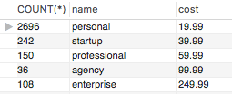
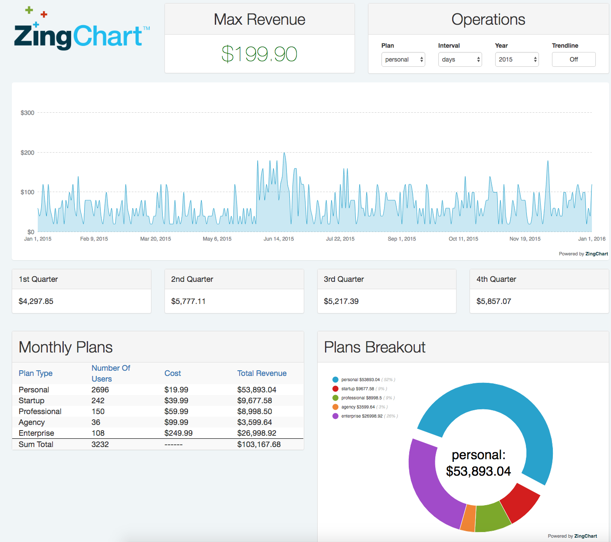

# What a Dashboard Is
A bootstrap dashboard for the web is just like the dashboard in your car. 
It needs to display the most relevant data at a glance. 
Similarly, the purpose of a dashboard on the web is to serve as a web page that 
anyone can look at to get an instant update as to the current state of their project.

## Building a Bootstrap Dashboard in 4 steps
### 1. Construct the Database Tables

The first step in making a dashboard is to create your tables in MySQL that will organize your data coherently. 
The following UML diagram was built using a very handy tool called MySQL Workbench.

The Plans table holds the “plans” offered by this company. 
For example, I inserted some data into this table using a query like this
`INSERT INTO plans VALUES (name=’personal’,cost=19.99,expected=50)’
and
INSERT INTO plans VALUES (name=’startup’,cost=29.99,expected=40);`
And so on…
The Sales table represents the dates that the company has sold a plan to their clients. For example
`INSERT INTO sales VALUES (date=’12-25-15’,plans_id=1);`

This table has a foreign key that is linked to the Plans table on the attribute ‘plans-id’. 
All this means is that this sale correlates to a plan that already exists in the Plans table. Makes sense right?

You can view the SQL queries I used on the repo [here] to see how I populated the database tables.
### 2. Get and Build Data Returned from database
Next we need to query the DB for the data we previously inserted. The following was written in PHP that was one such query:

`$plan_metadata_query = "SELECT COUNT(*),plans.name, plans.cost FROM sales INNER JOIN plans ON sales.id=plans.id GROUP BY sales.id";`

This query returns the number of each of the plans sold as well as the cost of each plan. The results look like this:



Parsing this data in PHP is really simple. We just need to loop over each ‘row’ of the data and store this in arrays like so:

```
$salesCounts = [];
  $planNames = [];
  $planCosts = [];
  $totalRevenues = [];
  if ($result = $mysqli->query($plan_metadata_query)) {
    // Fetch the result row as a numeric array
    while( $row = $result->fetch_array(MYSQLI_NUM)){
      array_push($salesCounts, $row[0]*1);
      array_push($planNames, $row[1]);
      array_push($planCosts, $row[2]*1);
      array_push($totalRevenues, $row[2] * $row[0]);
    }
    // Free the result set
    $result->close();
  }

  $mysqli->close();
```

Before we stuff these arrays into a JSON object, we need to calculate the revenue of each plan. To do this, I wrote the following:

```
$sumTotal = 0;
 for ($i = 0; $i < count($totalRevenues); $i++) {
     $sumTotal += $totalRevenues[$i];
 }
```

Great! Now we stuff these arrays into a JSON object like this:

```
$data = array(
    names => $planNames,
    salesCounts => $salesCounts,
    prices => $planCosts,
    totalRevenues => $totalRevenues,
    sumTotal => $sumTotal
);
```

A JavaScript Object Notation (JSON) object is just a structure that can contain: Strings, Numbers, booleans, Arrays, and Objects which are separated by commas and wrapped in curly braces. Functions are not valid. A typical JSON object could look like this:

```
{
    first_name: ‘Justin’,
    last_name: ‘Bogart’,
    salary: 100,000,000.00,
    Email: jbogart@zingchart.com
    company: {
        name: ‘ZingChart’,
        email: support@zingchart.com
        numEmployees: 100
    }
}
```

Now that we have built the data structure, it is ready for consumption by the client. So let’s send it to them when they request it. The following is how we send back this JSON:

`echo json_encode($data);`

All this function did was convert the data we had earlier into a JSON formatted similarly as shown above.

### 3. Request Data from Client-side
At this point, we will be working on the client-side, meaning JavaScript. JavaScript allows us to make HTTP requests to our server that is holding and executing the PHP code for us. And it is here, on the client-side, where our charts live. Let’s get started.

First we request the data from the server using AJAX. An AJAX request will allow us to get the data from the server without refreshing the page. Using AJAX allows the web page to continue executing without waiting for the request to return. This AJAX request could look like this:

```
// Instantiating an instance of the AJAX request. Xhr stands for XMLHttpRequest
var xhr = new XMLHttpRequest();
xhr.open("GET", "chart1_feed.php");// this is an HTTP GET request
xhr.setRequestHeader("Content-Type", "application/json");// Setting the HTTP header to expect a JSON response
xhr.addEventListener("load", function() {
    var data = JSON.parse(this.responseText);


    // myConfig is our default chart json configuration, shown later
    myConfig1.series[0].values = data.series;// storing data from server to the series values
    myConfig1.scaleX.values = data.dates;// storing the data from server to the x-axis scales


    // Render the chart
    zingchart.render({
        id : 'chart1',// this id is from your HTML element, usually a Div element
        data : myConfig1,
        height: 400,
        width: '100%'
    });// notice that the argument to this render function is a JSON as well.

    // Print the Max Revenue
    document.getElementById('chart1-maxValue').innerHTML = (data.maxRevenue).formatMoney(2);
});

// Send the request off to the server
xhr.send();
```
### 4. Render the Charts in a Dashboard
At this point the chart is already rendered. The initial configuration is used to specify what the chart will look like.
For example, if we want to build an area chart with a draggable legend with a title we need to tell ZingChart what we want.
To talk to ZingChart we supply it with a configuration in the form of … yep, you guessed it, a JavaScript object.

```
var myConfig1 = {
    type: ‘area’,
    legend: {
        draggable: true,
        title: {
            text: ‘Legend Title’
        }
    },
    Series: [
        {
            values: [ 25, 34, 33, 56, 71, 89, 120, 75 ]
        }
    ]
};
```

Here is a snapshot of what the final finished dashboard looks like. 
Note that this image contains more than what was presented in this document. 
Otherwise, feel free to [interact with the real thing](https://examples.zingchart.com/dashboards/php).

